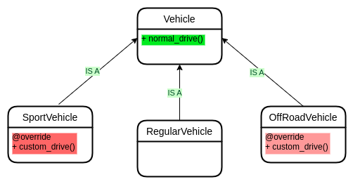
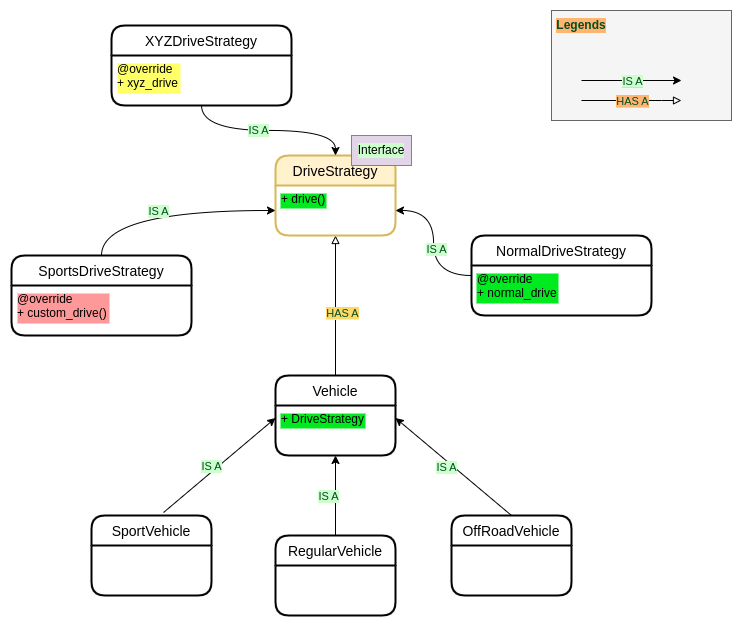

# Strategy Design pattern

### Problem Description

Code duplication occurs when children use some similar capabilities which are not present in the base class. Find the
sample problem code [@problem-code](./src/problem/main.py)

### Diagrammatic explanation

In the above diagram, as we can see `SportVehicle` and `OffRoadVehicle` are not using the
`drive()` method from the base class, rather they are using their own implementation of the `drive` method which is
normal.
However, they are using same implementation of the `drive` method (just imagine). As a result, code duplication between
these 2 children classes happened.

**So, code duplication happens when 2 or more children classes have same requirement for some capability which is not
present in the base class**

### Solution

A drive strategy will be used as a `has-a` relationship with the base class. Child class will pass the strategy using
in `constructor injection` according to its need.

Solution code is available [@solution](./src/solution/main.py)

### Diagrammatic explanation

